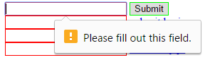
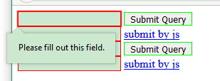
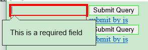

# input-validator
Lightweight validator for input control.

If you only use `core.js`. You will see different notification on different browser.

| Chrome | Firefox | IE |
| --- | --- | --- |
|  |  |  |

Test this [core feature online](https://zhoukekestar.github.io/input-validator/test/core.html).

# Features
* `setDefaultMessages` to set messages for `patternMismatch`, `valueMissing` and so on. [Try this online.](https://zhoukekestar.github.io/input-validator/test/core-default-messages.html)

  ```js
  HTMLInputValidatorElement.setDefaultMessages({
    valueMissing: 'Sorry, you have to input this. by default message~'
  })
  ```

* `registerType` to register your custom type.  [Try this online.](https://zhoukekestar.github.io/input-validator/test/core-register-type.html)

  ```html
  <form>
    <input type='OneORZero'>
  </form>
  <script>
    HTMLInputValidatorElement.registerType('OneORZero', function (value) {
      if (value === '0' || value === '1') return '';
      return 'Please input 0 or 1.';
    });
  </script>
  ```

* `title` Set title to show custom message. [Try this online.](https://zhoukekestar.github.io/input-validator/test/core-title.html)

  ```html
  <form>
    <input name="key" required title='This field is required! by title~'>
  </form>
  ```


# Events
This is an enhancement feature (not W3C). Because native `invalid` event can't bubbles to parents.
* `input-valid` if an input set a valid value.
* `input-invalid` if an input set a invalid value.

# Submit
This is an enhancement feature (not W3C).

Browser won't check validity if you call native submit by js. We hook the native
submit to check validity. So you can submit form by `input`, `button` or `submit()`.

```html
<form>
  <input name='key'>
  <input type='submit'>
  <button>button</button>
  <a href="javascript:;" onclick='this.parentNode.submit()'>submit()</a>
</form>
```

# Browser Compatibility
* `checkValidity` [IE 10+](http://caniuse.com/#search=checkValidity)

# Third Party
* `form-json` This library works well with form-json. [Try this online.](https://zhoukekestar.github.io/input-validator/test/work-with-form-json.html)
  ```html
  <form enctype="application/form-json">
    <input name='name' required title='you have to input this field ~'>
    <input type='submit' />
  </form>
  ```

# Read More
* [constraintvalidation on html5rocks](https://www.html5rocks.com/en/tutorials/forms/constraintvalidation/)
* [Form_validation on MDN](https://developer.mozilla.org/en-US/docs/Learn/HTML/Forms/Form_validation)
